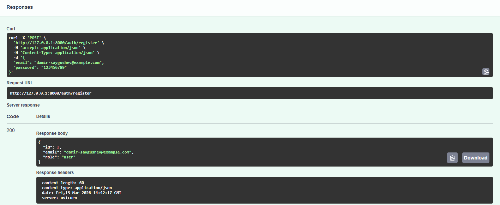
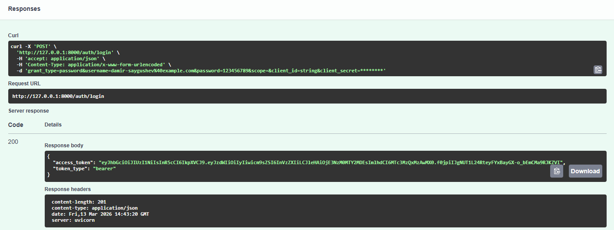
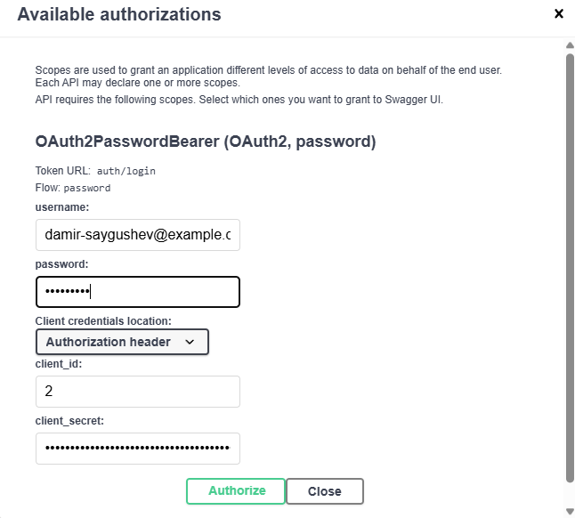
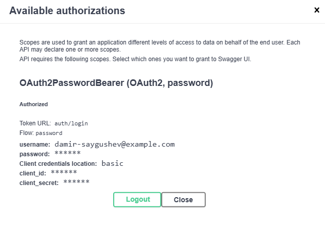
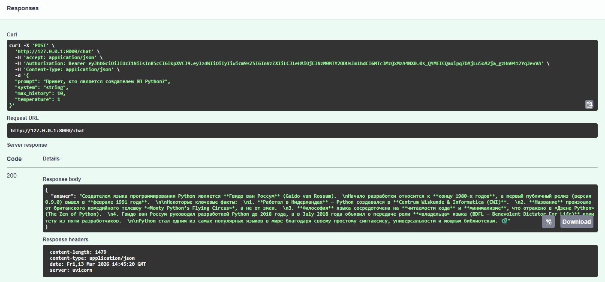
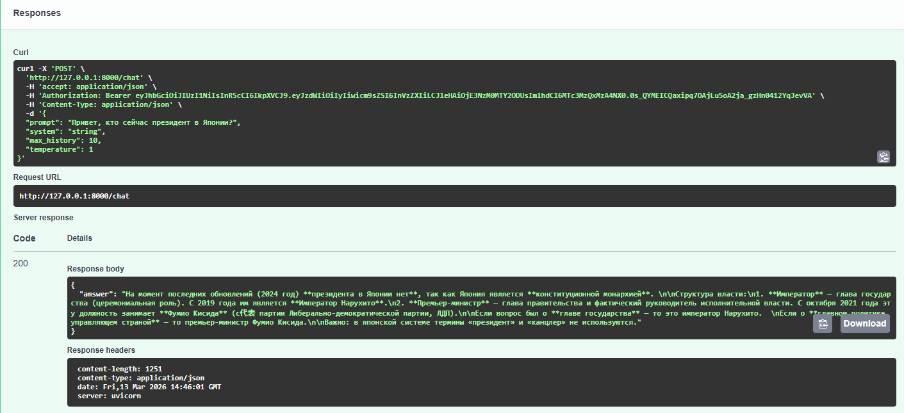
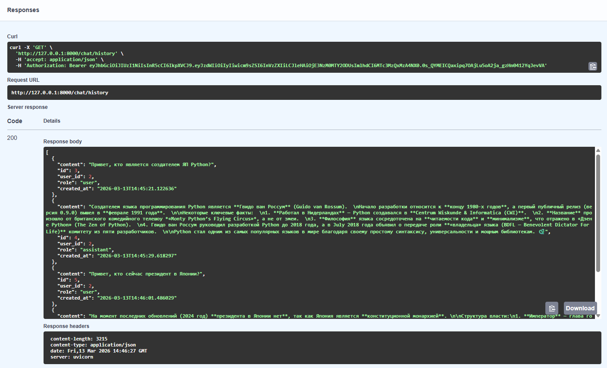
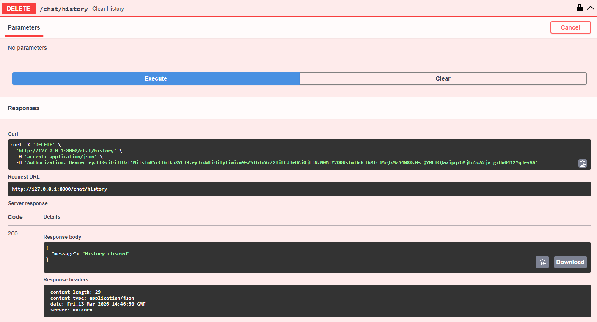
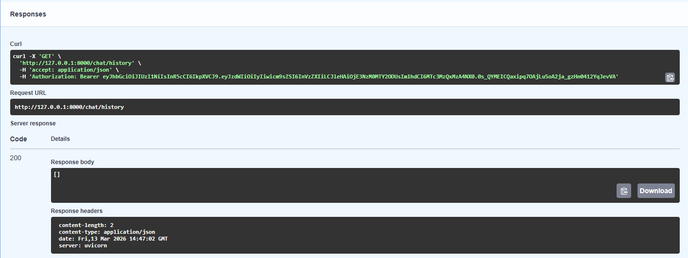

# protected_api_for_llm_Saygushev_M25-555

**Protected LLM API** — это производительный асинхронный бэкенд на FastAPI, построенный по принципам **Clean Architecture** для работы с OpenRouter.

---

## 🚀 Установка

Для запуска проекта вам понадобится **Python 3.12+** и установленный менеджер пакетов [**uv**].

### Шаги установки

1. **Склонируйте репозиторий**:

    ```bash
    git clone https://github.com/gol43/llm-p.git
    cd llm-p
    ```

2. **Установите зависимости**:

    ```bash
    make install
    ```

3. **Создайте .env**:

    Прямо по примеру из env.example

4. **Запустите проект**:

    ```bash
    make run
    ```

---
## Скриншоты работы проекта для проверки


1. Регистрация пользователя



2. Логин и получение JWT



3. Авторизация через Swagger



4. Вызов POST /chat



5. Получение истории через GET /chat/history



6. Удаление истории через DELETE /chat/history




---

## 🗂 Структура проекта
```
llm_p/
├── pyproject.toml                 # Зависимости проекта (uv)
├── README.md                      # Описание проекта и запуск
├── .env.example                   # Пример переменных окружения
│
├── app/
│   ├── init.py
│   ├── main.py                    # Точка входа FastAPI
│   │
│   ├── core/                      # Общие компоненты и инфраструктура
│   │   ├── init.py
│   │   ├── config.py              # Конфигурация приложения (env → Settings)
│   │   ├── security.py            # JWT, хеширование паролей
│   │   └── errors.py              # Доменные исключения
│   │
│   ├── db/                        # Слой работы с БД
│   │   ├── init.py
│   │   ├── base.py                # DeclarativeBase
│   │   ├── session.py             # Async engine и sessionmaker
│   │   └── models.py              # ORM-модели (User, ChatMessage)
│   │
│   ├── schemas/                   # Pydantic-схемы (вход/выход API)
│   │   ├── init.py
│   │   ├── auth.py                # Регистрация, логин, токены
│   │   ├── user.py                # Публичная модель пользователя
│   │   └── chat.py                # Запросы и ответы LLM
│   │
│   ├── repositories/              # Репозитории (ТОЛЬКО SQL/ORM)
│   │   ├── init.py
│   │   ├── users.py               # Доступ к таблице users
│   │   └── chat_messages.py       # Доступ к истории чатов
│   │
│   ├── services/                  # Внешние сервисы
│   │   ├── init.py
│   │   └── openrouter_client.py   # Клиент OpenRouter / LLM
│   │
│   ├── usecases/                  # Бизнес-логика приложения
│   │   ├── init.py
│   │   ├── auth.py                # Регистрация, логин, профиль
│   │   └── chat.py                # Логика общения с LLM
│   │
│   └── api/                       # HTTP-слой (тонкие эндпоинты)
│       ├── init.py
│       ├── deps.py                # Dependency Injection
│       ├── routes_auth.py         # /auth/*
│       └── routes_chat.py         # /chat/*
│
└── app.db                         # SQLite база (создаётся при запуске)
```

---

## 👨‍💻 Автор

Проект разработан студентом НИЯУ МИФИ:  
**Сайгушев Дамир Даниярович**  
- GitHub: [gol43](https://github.com/gol43)  
- Telegram: [@spongedmw](https://t.me/spongedmw)

---